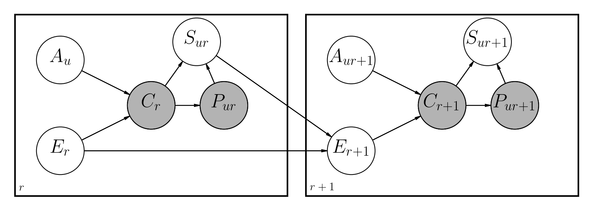

# pyClickModels

A Cython implementation of [ClickModels](https://github.com/varepsilon/clickmodels) that uses Probabilistic Graphical Models to infer user behavior when interacting with Search Page Results (Ranking).

## How It Works

ClickModels uses the concept of [Probabilistic Graphical Models](https://en.wikipedia.org/wiki/Graphical_model) to model components that describe the interactions between users and a list of items ranked by a set of retrieval rules.

These models tend to be useful when it's desired to understand whether a given document is a good match for a given search query or not which is also known in literature as *Judgments* grades. This is possible through evaluating past observed clicks and the positions at which the document appeared on the results pages for each query.

There are several [proposed approaches](https://clickmodels.weebly.com/uploads/5/2/2/5/52257029/mc2015-clickmodels.pdf) to handle this problem. This repository implements a Dynamic Bayesian Network, similar to [previous works](https://github.com/varepsilon/clickmodels) also done in Python:



Main differences are:

1. **Implemented on top of Cython**: solutions already public available rely on CPython integrated with PyPy for additional speed ups. Unfortunatelly this still might not be good enough in terms of performance. To work on that, this implementation relies 100% on C/C++ for further optimization in speed. Despite not having an official benchmark, it's expected an improvement of **15x** ~ **18x** on top of CPython (same data lead to an increase of ~3x when using PyPy).
2. **Memory Friendly**: expects input data to follow a JSON format with all sessions of clickstream already expressed for each row. This saves memory and allows for the library to process bigger amounts of data.
3. **Purchase variable**: as businesses such as eCommerces can greately benefit from better understanding their search engine, this repository added the variable Purchase to further describe customers behaviors.

The file [notebooks/DBN.ipynb](notebooks/DBN.ipynb) has a complete description of how the model has been implemented along with all the mathematics involved.


## Instalation

As this project relies on binaries compiled by Cython, currently only CPython36 for Linux is supported. It can be installed with:

    pip install pyClickModels

## Getting Started

### Input Data

pyClickModels expects input data to be stored in a set of compressed `gz` files located on the same folder.
Each file should contain line separated JSONs. The following is an example of each JSON line:

```json
{
    "search_keys": {
        "search_term": "blue shoes",
        "region": "south",
	"favorite_brand": "super brand",
	"user_size": "L",
	"avg_ticket": 10
    },
    "judgment_keys": [
        {
	    "session": [
                {"click": 0, "purchase": 0, "doc": "doc0"}
                {"click": 1, "purchase": 0, "doc": "doc1"}
                {"click": 1, "purchase": 1, "doc": "doc2"}
	    ]
        },
        {
	    "session": [
                {"click": 1, "purchase": 0, "doc": "doc0"}
                {"click": 0, "purchase": 0, "doc": "doc1"}
                {"click": 0, "purchase": 0, "doc": "doc2"}
	    ]
        }
    ]
}
```

The key `search_keys` sets the context for the search. In the above example, a given customer (or cluster of customers with the same context) searched for `blue shoes`. Their region is `south` (it could be any chosen value), favorite brand is `super brand` and so on.

These keys sets the context for which the search happened. When pyClickModels runs its optimization, it will consider all the context at once. This means that the Judgments obtained are also on the whole context setting.

If no context is desired, just use `{"search_keys": {"search_term": "user search"}}`. 

There's no required schema here which means the library loops through all keys available in `search_keys` and builds the optimization process considering the whole context as a single query.

As for the `judgment_keys`, this is a list of sessions. The key `session` is mandatory. Each session contains the clickstream of users (if the variable purchase is not required set it to 0).

For running DBN from pyClickModels, here's a simple example:

```python
from pyClickModels.DBN import DBN

model = DBN()
model.fit(input_folder="/tmp/clicks_data/", iters=10)
model.export_judgments("/tmp/output.gz")
```

Output file will contain a NEWLINE JSON separated file with the judgments for each query and each document observed for that query, i.e.:

```json
{"blue shoes|south|super brand": {"doc0": 0.2, "doc1": 0.3, "doc2": 0.4}}
{"other query": {"doc0": 0.0, "doc1": 0.0, "doc2": 0.1}}
```

Judgments here varies between 0 and 1. Some libraries requires it to range between integers 0 and 4. Choose a proper transformation in this case that better suits your data.

## Warnings

**This library is still alpha!** Use it with caution. It's been fully unittested but still parts of it uses pure C whose exceptions might not have been fully considered yet. It's recommended to, before using this library in production evironments, to fully test it with different datasets and sizes to evaluate how it performs.

## Contributing

Contributions are very welcome! Also, if you find bugs, please report them :).
